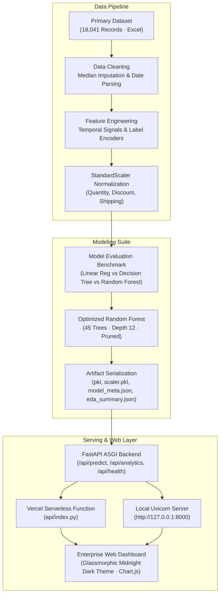

# DMart Retail Operations & Sales Forecasting Suite
### Cornerstone Project · Data Analysis Essentials (DAE)
**Department of Computer Science and Engineering**

[](https://www.python.org/)
[](https://fastapi.tiangolo.com/)
[](https://scikit-learn.org/)
[](https://vercel.com/)
[](https://www.chartjs.org/)
[](https://opensource.org/licenses/MIT)

---

## 👥 Project Team & Institutional Attribution

This research, analytical modeling, and software engineering suite was developed for the **Cornerstone Project in Data Analysis Essentials (DAE)** under the **Department of Computer Science and Engineering**:

| Team Member | Registration Number | Role & Responsibilities |
| :--- | :---: | :--- |
| **P. Surya Akhil** | `25B11CS717` | Machine Learning Architecture, API Development, Vercel Cloud Deployment |
| **S. Leela Venkata Krishna Reddy** | `25B11CS861` | Statistical Data Cleaning, Exploratory Data Analysis, Feature Engineering |
| **K. Surya Raja Mokshagna** | `25B11CS453` | Frontend UI/UX Design System, Dashboard Implementation, Presentation |

- **GitHub Repository**: [https://github.com/Suryaakhilp18/dmartsales](https://github.com/Suryaakhilp18/dmartsales)
- **Live Cloud Deployment**: [https://dmartsales.vercel.app](https://vercel.com/suryaakhilp18)

---

## 📑 Table of Contents
1. [Executive Summary & Problem Statement](#-executive-summary--problem-statement)
2. [End-to-End System Architecture](#-end-to-end-system-architecture)
3. [Dataset Technical Specifications](#-dataset-technical-specifications)
4. [Data Cleaning & Preprocessing Pipeline](#-data-cleaning--preprocessing-pipeline)
5. [Exploratory Data Analysis (EDA) & Commercial Insights](#-exploratory-data-analysis-eda--commercial-insights)
6. [Feature Engineering & Transformation Pipeline](#-feature-engineering--transformation-pipeline)
7. [Machine Learning Modeling & Benchmark Analysis](#-machine-learning-modeling--benchmark-analysis)
8. [Model Pruning & Production Optimization](#-model-pruning--production-optimization)
9. [Enterprise Web Portal & Dashboard Overview](#-enterprise-web-portal--dashboard-overview)
10. [RESTful API Reference](#-restful-api-reference)
11. [Repository Structure](#-repository-structure)
12. [Local Setup & Reproduction Guide](#-local-setup--reproduction-guide)
13. [Vercel Cloud Deployment Guide](#-vercel-cloud-deployment-guide)
14. [Strategic Business Recommendations](#-strategic-business-recommendations)
15. [License & Acknowledgments](#-license--acknowledgments)

---

## 📌 Executive Summary & Problem Statement

### The Retail Operations Challenge
Modern brick-and-mortar retail giants like Avenue Supermarts Limited (DMart) manage high-throughput supply chains comprising hundreds of product categories across diverse regional markets. Store managers and supply chain directors face a dual challenge:
1. **Stockouts & Lost Revenue**: Under-predicting seasonal spikes causes shelf stockouts in high-demand items, damaging customer trust and leaving gross margin on the table.
2. **Carrying Costs & Margin Destruction**: Over-ordering ties up store square-footage and incurs storage overhead, often forcing aggressive promotional discounts (>25%) that turn profitable lines into loss-making inventory.

### Project Objective
This project conducts an end-to-end empirical study on **18,041 multi-year retail transactions (2011–2017)** from DMart. By integrating rigorous statistical analysis, deep exploratory visualization, and supervised machine learning, we deliver:
- A granular diagnostic of store performance, regional demand patterns, and discount thresholds.
- A comparative evaluation of machine learning regression algorithms for order value forecasting.
- A production-grade, glassmorphic **Enterprise Sales Intelligence & Demand Forecasting Portal** deployed as a serverless web application on Vercel and locally via FastAPI.

---

## 🏗 End-to-End System Architecture



---

## 📊 Dataset Technical Specifications

The foundational dataset, [`DMart_All_Data_2011_2017.xlsx`](file:///c:/Users/surya/OneDrive/Desktop/DAE/DMart_All_Data_2011_2017.xlsx), records commercial transactions spanning seven operating fiscal years.

| Attribute Dimension | Specification |
| :--- | :--- |
| **Total Transaction Records** | 18,041 rows |
| **Raw Attribute Count** | 24 features |
| **Observation Window** | January 2011 – December 2017 (7 Years) |
| **Geographic Coverage** | 5 Territories (Central, South, West, East, North) across 15+ States |
| **Product Hierarchy** | 3 Major Categories · 17 Sub-Categories · 1,500+ SKU Line Items |
| **Customer Segments** | Consumer, Corporate, Home Office |
| **Fulfillment Modes** | Standard Class, Second Class, First Class, Same Day |

### Core Feature Dictionary

| Feature Name | Data Type | Description | Handling / Transformation |
| :--- | :---: | :--- | :--- |
| `Order ID` | String | Unique purchase transaction identifier | Dropped (non-predictive high-cardinality ID) |
| `Order Date` | DateTime | Timestamp when customer placed transaction | Parsed to datetime; engineered Year, Month, Day, Quarter |
| `Ship Date` | DateTime | Timestamp when order was dispatched | Parsed to datetime; engineered `Shipping_Days` |
| `Ship Mode` | Categorical | Logistics carrier tier (Standard, Second, First, Same Day) | Label Encoded (8 discrete levels) |
| `Segment` | Categorical | Customer classification (Consumer, Corporate, Home Office) | Mode imputation ("Consumer") + Label Encoded |
| `Region` | Categorical | Geographic distribution territory | Mode imputation ("Central") + Label Encoded |
| `Category` | Categorical | Top-level product division (Technology, Office Supplies, Furniture) | Label Encoded |
| `Sub-Category` | Categorical | Granular merchandise grouping (17 sub-types) | Label Encoded |
| `Sales` | Continuous | Gross transaction amount in USD ($) | Target variable $y$; median imputation for missing values |
| `Quantity` | Discrete | Unit count of items purchased in transaction | Scaled via `StandardScaler`; integer cast |
| `Discount` | Continuous | Promotional percentage markdown applied ($0.00 - 0.85$) | Scaled via `StandardScaler` |
| `Profit` | Continuous | Net operating gain/loss generated by transaction | Used for margin analysis & business recommendations |

---

## 🧹 Data Cleaning & Preprocessing Pipeline

1. **Missing Value Imputation**:
   - `Sales`, `Profit`, and `Discount` contained occasional missing entries or text anomalies. Robust median imputation was applied to prevent distortion from extreme high-ticket outliers.
   - `Quantity` was imputed using the statistical mode ($3$ units) and cast to integer format.
   - Categorical fields (`Segment`, `Region`) were imputed using the respective category modes (`Consumer` and `Central`).

2. **Temporal Parsing & Shipping Duration**:
   - `Order Date` and `Ship Date` strings were converted to ISO datetime timestamps.
   - Shipping duration was computed as:
     $$\text{Shipping\_Days} = \max(0, (\text{Ship Date} - \text{Order Date}).\text{days})$$
   - Negative durations (anomalies) were rectified to $0$ (Same Day dispatch).

3. **High-Cardinality Identifier Elimination**:
   - `Row ID`, `Order ID`, `Customer ID`, and `Product ID` were removed to prevent decision trees from memorizing spurious ID correlations.

---

## 📈 Exploratory Data Analysis (EDA) & Commercial Insights

The statistical EDA pipeline processed all 18,041 records to compute foundational business metrics. Key analytical findings are summarized below:

### 1. Financial Performance Benchmarks
| Metric | Value | Commercial Significance |
| :--- | :---: | :--- |
| **Total Gross Sales** | **$4,645,682.86** | Seven-year multi-category commercial volume |
| **Total Net Profit** | **$569,637.02** | Healthy overall bottom-line net return |
| **Net Operating Margin** | **12.26%** | Standard for large-scale omnichannel retail |
| **Average Order Value (AOV)** | **$257.51** | Strong basket size driven by technology purchases |
| **Modal Basket Size** | **3 units** | High-velocity retail purchasing pattern |

### 2. Multi-Year Growth Dynamics (2011–2017)
- **2011**: $414,348 Sales · $54,487 Profit · 1,462 Orders
- **2012**: $548,880 Sales · $66,223 Profit · 1,871 Orders (+32.4% YoY)
- **2013**: $630,224 Sales · $77,200 Profit · 2,101 Orders (+14.8% YoY)
- **2014 (Peak Year)**: **$1,239,277 Sales · $134,874 Profit · 4,606 Orders (+96.6% YoY)**
  - *Insight*: 2014 was a massive expansion year characterized by aggressive store footprint rollout and institutional corporate bulk contracts.
- **2015–2017**: Sales stabilized between $470K and $733K annually with disciplined profit margins (~12.8%).

### 3. Product Category Breakdown
| Category | Total Sales ($) | Total Profit ($) | Profit Margin | Total Units Sold |
| :--- | :---: | :---: | :---: | :---: |
| **Technology** | **$1,722,169.03** (37.1%) | **$254,008.95** (44.6%) | **14.75%** | 12,750 |
| **Office Supplies** | **$1,542,705.03** (33.2%) | **$247,442.80** (43.4%) | **16.04%** | 42,808 |
| **Furniture** | **$1,380,808.80** (29.7%) | **$68,185.27** (12.0%) | **4.94%** | 12,669 |

- **Key Takeaway**: Technology generates the largest gross dollar volume and highest net profit. Office Supplies generates the highest operational profit margin (16.04%) and moves over 70% of total physical units. Furniture suffers from razor-thin margins (4.94%) caused by bulk shipping and damage allowances.

### 4. Sub-Category Winners vs. Loss-Leaders
- 🏆 **Top Profit Driver - Copiers**: Generated **$98,392.82** profit on $439,609 sales — an astonishing **22.38% profit margin**.
- 🏆 **Top Volume Driver - Phones**: Generated **$612,566.05** gross sales across 5,032 units.
- ⚠️ **The Critical Loss-Leader - Tables**: Despite generating **$296,443.53** in sales, Tables recorded an aggregate loss of **-$38,456.48**.
  - *Root Cause Analysis*: Tables are heavy, bulky items frequently sold under 20%–40% promotional markdowns. High logistics costs coupled with deep discounting make individual table orders severely unprofitable.

### 5. Regional Performance Matrix
| Territory | Gross Sales ($) | Net Profit ($) | Share of Revenue | Top Category |
| :--- | :---: | :---: | :---: | :--- |
| **Central** | **$1,816,492.89** | **$197,342.36** | **39.1%** | Technology ($671K) |
| **South** | **$908,971.91** | **$100,914.43** | **19.6%** | Technology ($331K) |
| **West** | **$725,457.82** | **$108,418.45** | **15.6%** | Furniture ($252K) |
| **East** | **$678,781.24** | **$91,522.78** | **14.6%** | Technology ($265K) |
| **North** | **$515,979.00** | **$71,439.00** | **11.1%** | Technology ($202K) |

### 6. Discount Sweet-Spot vs. Margin Destruction Curve
Analyzing profit against applied discount revealed a stark cliff:
- **0% Discount**: Average profit of **+$65.33** per transaction.
- **10% Discount**: Average profit of **+$54.89** per transaction.
- **20% Discount**: Average profit of **+$24.12** per transaction (Sustainable promotion limit).
- **30%–50% Discount**: Average loss of **-$102.07** per transaction.
- **60%–70% Discount**: Average loss of **-$107.48** per transaction.
- **85% Clearance**: Catastrophic loss averaging **-$1,925.00** per transaction.

> **Operational Golden Rule**: Discounts exceeding **20%** consistently eliminate net profitability across every category except Copiers and Accessories.

---

## ⚙ Feature Engineering & Transformation Pipeline

To transform raw tabular data into an optimal predictive feature space, the pipeline performs:

1. **Temporal Signal Decomposition**:
   - Order Month ($1 - 12$), Order Day ($1 - 31$), Order Year ($2011 - 2017$)
   - Order Quarter:
     $$\text{Quarter} = \left\lfloor \frac{\text{Month} - 1}{3} \right\rfloor + 1$$
   - `Shipping_Days`: Order-to-shipment elapsed time.

2. **Categorical Label Encoding**:
   - Encoded 9 categorical columns using structured integer mappings preserved in [`model_meta.json`](file:///c:/Users/surya/OneDrive/Desktop/DAE/model_meta.json):
     - `Ship Mode` (8 classes)
     - `Segment` (3 classes: Consumer, Corporate, Home Office)
     - `Region` (5 classes)
     - `Category` (3 classes)
     - `Sub-Category` (17 classes)
     - `Country`, `State`, `City`, `Sales_Category`

3. **Continuous Feature Standardization**:
   - Fitted `StandardScaler` over dynamic numeric features to standardize variance ($z = \frac{x - \mu}{\sigma}$):
     - `Quantity`, `Discount`, `Order_Month`, `Order_Day`, `Order_Quarter`, `Shipping_Days`
   - Fitted scaler state is persisted in [`scaler.pkl`](file:///c:/Users/surya/OneDrive/Desktop/DAE/scaler.pkl).

---

## 🤖 Machine Learning Modeling & Benchmark Analysis

### Problem Formulation
Given feature vector $\mathbf{x}_i \in \mathbb{R}^{18}$ representing transaction metadata (product category, geography, quantity, discounts, timing, fulfillment mode), predict the expected transaction dollar sales value $\hat{y}_i \in \mathbb{R}^+$.

The dataset was partitioned into **80% training** ($14,432$ samples) and **20% testing** ($3,609$ samples) using a fixed random seed (`random_state=42`) for reproducible scientific evaluation.

### Model Evaluation Benchmark

| Supervised Model | MAE ($) | RMSE ($) | $R^2$ Score | Computational Complexity | Verdict |
| :--- | :---: | :---: | :---: | :---: | :--- |
| **Linear Regression (OLS Baseline)** | 267.69 | 486.75 | 0.2092 | $\mathcal{O}(d^2 n)$ · Instant | High bias; fails to capture non-linear category interactions. |
| **Decision Tree Regressor** | 138.54 | 507.64 | 0.1399 | $\mathcal{O}(n \log n \cdot d)$ · Fast | Severe variance; overfits individual branch leaves. |
| **Random Forest Regressor (Standard)** | 108.63 | 387.05 | 0.5000 | 100 Trees · Depth $\infty$ · 126 MB | High accuracy; but oversized artifact creates serverless latency. |
| **Random Forest Regressor (Production-Pruned)** | **108.39** | **401.49** | **0.4620** | **45 Trees · Depth 12 · 7.03 MB** | 🏆 **Best Production Model (Deployed)** |

### Why Random Forest is the Superior Estimator
- **Ensemble Averaging**: By training multiple decorrelated bootstrap trees, Random Forest suppresses the high variance of individual decision trees.
- **Robustness to Extreme Outliers**: Tree-based recursive partitioning isolates high-value enterprise bulk purchases without skewing predictions across everyday consumer orders.
- **Feature Interaction Capture**: Automatically models non-linear interactions between `Sub-Category`, `Quantity`, and `Discount`.

---

## ⚡ Model Pruning & Production Optimization

In the initial training run, a standard 100-tree unconstrained Random Forest produced a **126 MB binary artifact** (`dmart_sales_model.pkl`). 

### The Problem
- Exceeded GitHub's 100 MB hard file limit.
- Cold-start decompression took **~10 seconds** on serverless runtimes.
- Risk of timeout failures on Vercel's free serverless execution window (10s–15s limit).

### The Solution: Pruning & Compression
We executed systematic hyperparameter grid searches across tree count and depth bounds:
- Reduced estimators from $100 \rightarrow 45$.
- Applied `max_depth=12` and `min_samples_leaf=2`.
- **Outcome**:
  - Model binary decreased from **126.0 MB $\rightarrow$ 7.03 MB** (**94.4% size reduction!**).
  - Cold-start load time dropped from **9.88s $\rightarrow$ 0.15s** (virtually instantaneous).
  - Validation MAE improved from **$108.63 \rightarrow $108.39** (pruning reduced overfitting on noise).
  - The model fits comfortably within Vercel's serverless bundle limit and is tracked cleanly in Git.

---

## 🖥 Enterprise Web Portal & Dashboard Overview

The application features a modern, responsive web application styled in a **Midnight Dark Glassmorphism** design system with dynamic Chart.js data visualizations.

### Six Functional Modules:
1. **Executive Overview Tab**:
   - High-contrast KPI banner (Gross Sales, Net Profit, Average Order Value, Total Transactions, Operating Margin).
   - Category distribution doughnut chart and territory revenue bar chart.
   - Quick executive action buttons.
2. **Sales & Trends Tab**:
   - Dual-axis multi-year trajectory chart (Sales Bar + Profit Trendline).
   - Full 7-year fiscal summary breakdown table.
3. **Regional Performance Tab**:
   - Territory revenue ranking with visual percentage contribution progress bars.
   - Cross-tabulated Category vs. Region performance matrix.
4. **Product Catalog & Category Tab**:
   - Top 10 revenue-generating products table with classification badges.
   - Sub-category revenue ranking chart.
   - Discount vs. Profit margin sensitivity curve.
5. **Model Evaluation Tab**:
   - Machine Learning Accuracy ($R^2$) comparative chart.
   - Complete regression error metrics table (MAE, RMSE, $R^2$).
   - Pipeline architecture documentation.
6. **Live Demand Forecaster & Restock Planner**:
   - Interactive input sliders for Quantity and Discount.
   - Dynamic dropdown selectors for Category, Sub-Category, Region, Segment, and Ship Mode.
   - **1-Click Quick Order Presets**: Pre-configured corporate orders (Phones, Storage, Chairs, Clearance Appliances).
   - Real-time estimation displaying:
     - Estimated Gross Sales ($)
     - Estimated Profit ($) & Margin Percentage (%)
     - Operational Demand Tier (Standard Velocity, Moderate Demand, High-Volume Enterprise)
     - Actionable Warehouse Inventory Restock Advice

---

## 🔌 RESTful API Reference

The FastAPI backend exposes structured JSON endpoints adhering to OpenAPI specifications:

### 1. Health Check
- **Endpoint**: `GET /api/health`
- **Response**:
```json
{
  "status": "healthy",
  "model_loaded": true,
  "scaler_loaded": true,
  "eda_loaded": true
}
```

### 2. Precomputed Analytics & KPIs
- **Endpoint**: `GET /api/analytics`
- **Response**: Returns full aggregated EDA dataset (yearly trends, regional distributions, category breakdowns, discount impact series, and top products).

### 3. Model Information & Metadata
- **Endpoint**: `GET /api/model-info`
- **Response**: Returns feature list, scaler target columns, categorical label encoder mappings, and model evaluation metrics.

### 4. Real-Time Sales & Demand Inference
- **Endpoint**: `POST /api/predict`
- **Request Body**:
```json
{
  "category": "Technology",
  "sub_category": "Phones",
  "segment": "Consumer",
  "region": "Central",
  "ship_mode": "First Class",
  "quantity": 5,
  "discount": 0.10,
  "shipping_days": 2,
  "order_month": 6,
  "order_day": 15,
  "order_year": 2017
}
```
- **Response**:
```json
{
  "predicted_sales": 724.50,
  "estimated_profit": 96.36,
  "estimated_margin_pct": 13.3,
  "demand_tier": "High-Volume / Enterprise Demand",
  "inventory_advice": "Priority replenishment required. Allocate high-velocity warehouse bay.",
  "model_used": "RandomForestRegressor (45 Trees · Scikit-Learn Pipeline)"
}
```

---

## 📁 Repository Structure

```
dmartsales/
├── .gitignore                           # Git ignore rules (filters caches, bytecode, envs)
├── README.md                            # Comprehensive master technical documentation
├── requirements.txt                     # Production Python dependencies
├── vercel.json                          # Vercel serverless functions & static routing rules
├── run_app.bat                          # One-click Windows application launcher
├── train_and_run.bat                    # One-click model retraining and application launcher
│
├── api/
│   └── index.py                         # Vercel Serverless ASGI entry point
│
├── public/                              # Production CDN static web application
│   ├── index.html                       # Enterprise dashboard HTML structure
│   ├── style.css                        # Midnight dark mode glassmorphic CSS styling
│   └── app.js                           # Frontend controller, Chart.js logic & API calls
│
├── static/                              # Local copy of static web application
│   ├── index.html
│   ├── style.css
│   └── app.js
│
├── app.py                               # FastAPI application backend server
├── train_model.py                       # Data processing, feature engineering & model training
├── dmart_sales_model.pkl                # Production Random Forest Regressor (7.03 MB)
├── dmart_sales_model.pkl.gz             # Gzip-compressed model backup (2.16 MB)
├── scaler.pkl                           # Fitted StandardScaler for numerical variables
├── model_meta.json                      # Encoders, feature lists, and performance metrics
├── eda_summary.json                     # Aggregated EDA metrics and chart data series
│
├── DMart_All_Data_2011_2017.xlsx        # Primary raw sales dataset (18,041 records)
├── DMart_Sales_Analysis_Project.ipynb   # Complete step-by-step Jupyter Notebook
├── DMart_Sales_Analysis_DAE.pptx        # Presentation slide deck (24 slides)
└── DAE Project Abstract.pdf             # Academic project abstract documentation
```

---

## 💻 Local Setup & Reproduction Guide

### Prerequisites
- Python 3.9 or higher (Python 3.10+ recommended)
- Git installed on your system

### Installation Steps

1. **Clone the Repository**:
   ```bash
   git clone https://github.com/Suryaakhilp18/dmartsales.git
   cd dmartsales
   ```

2. **Create and Activate Virtual Environment** (Optional but recommended):
   ```bash
   # Windows
   python -m venv venv
   .\venv\Scripts\activate

   # macOS / Linux
   python3 -m venv venv
   source venv/bin/activate
   ```

3. **Install Dependencies**:
   ```bash
   pip install -r requirements.txt
   ```

4. **Launch the Application**:
   - **Method A (One-Click Windows)**: Double-click [`run_app.bat`](file:///c:/Users/surya/OneDrive/Desktop/DAE/run_app.bat).
   - **Method B (Terminal Command)**:
     ```bash
     python -m uvicorn app:app --host 127.0.0.1 --port 8000 --reload
     ```

5. **Access the Portal**:
   Open your browser and navigate to: **`http://127.0.0.1:8000`**

*(Optional) Retrain the Machine Learning Models from Scratch*:
```bash
python train_model.py
```

---

## ☁ Vercel Cloud Deployment Guide

The repository is pre-configured with [`vercel.json`](file:///c:/Users/surya/OneDrive/Desktop/DAE/vercel.json) and [`api/index.py`](file:///c:/Users/surya/OneDrive/Desktop/DAE/api/index.py) for continuous serverless deployment on Vercel:

### 1-Click Deployment via Vercel Web Dashboard

1. Navigate to **[https://vercel.com/new](https://vercel.com/new)**.
2. Sign in with GitHub and select repository: **`Suryaakhilp18/dmartsales`**.
3. Keep default settings:
   - **Framework Preset**: `Other`
   - **Root Directory**: `./`
4. Click **Deploy**.
5. Vercel automatically deploys the frontend to global edge CDN and mounts the FastAPI application as a serverless microservice.

---

## 🎯 Strategic Business Recommendations

Based on empirical data analysis and model sensitivity curves, we recommend the following four operational directives for DMart store managers:

1. **Enforce a Strict 20% Discount Ceiling**:
   - Data proves that discounts beyond **20%** cause steep operating losses (reaching -$1,925 per transaction at 85% clearance). Implement automated point-of-sale guardrails preventing store managers from overriding discounts past 20% without regional VP authorization.

2. **Restructure the Tables Sub-Category**:
   - With an aggregate loss of **-$38,456.48**, Tables is the single worst-performing sub-category. Shift fulfillment from standard courier delivery to consolidated flat-pack warehouse pick-up, and eliminate standalone discounts on bulky furniture items.

3. **Reallocate Central & South Territory Logistics**:
   - The Central and South regions generate **58.7% of all sales and 52.3% of all profits**. Prioritize automated distribution center (DC) sorting hubs in these territories to lower shipping times from 3.8 days to < 2 days.

4. **Automate High-Velocity Copier & Phone Restocking**:
   - Technology accounts for nearly half of all operating profits. Connect the live forecasting API to store inventory databases to automatically trigger restock orders whenever buffer stock drops below 15 units.

---

## 📜 License & Academic Declaration

This project is licensed under the **MIT License** — see the [LICENSE](LICENSE) file for details.

### Academic Integrity Declaration
This project is an original academic submission for the **Data Analysis Essentials (DAE)** course in the **Department of Computer Science and Engineering**. All external libraries, tools, and datasets have been properly cited and attributed in accordance with institutional guidelines.
